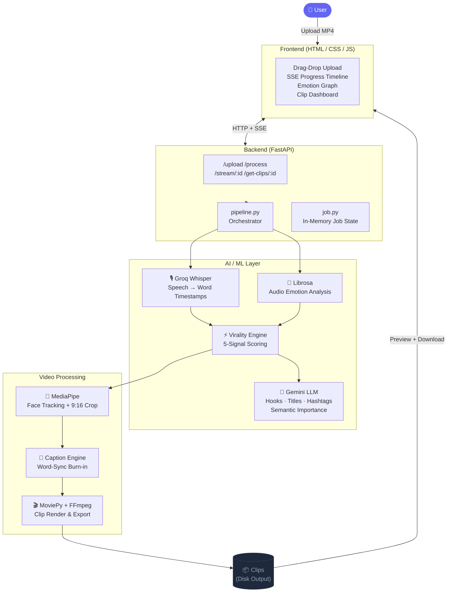

# ⚡ AttentionX

### *Turn hours of footage into viral-ready clips — in minutes, not months.*

AttentionX is a fully automated content repurposing engine. Upload a long-form video, and the AI pipeline identifies the highest-virality moments, crops them to 9:16, burns in word-synced captions, generates AI hooks, and delivers platform-ready short clips — zero manual editing required.

<div align="center">

[](https://attention-ai-mascarenhastest8237-u0q962lo.leapcell.dev)
[](https://youtu.be/rnxk6QlIal0)
[](https://github.com/abhi-india05/attention-ai)

</div>

---

## 🚨 The Problem

**Long-form content is dying on short-form platforms — but creators can't afford to ignore either.**

- A 45-minute podcast has 3–4 genuinely viral moments buried inside it. Finding them manually takes hours.
- Repurposing involves: watching the video, clipping, re-cropping to vertical, adding captions, writing hooks, choosing hashtags. That's a full editing day per video.
- Most creators either skip short-form entirely or pay expensive editors — both options hurt growth.

> **The brutal truth:** 80% of a video's viral potential goes to waste because repurposing is too painful to do consistently.

---

## 💡 The Solution

AttentionX replaces the entire repurposing workflow with a **5-signal AI virality engine**.

Upload once. The system analyzes every second of your video across audio energy, emotional intensity, semantic importance, keyword triggers, and curiosity patterns — then automatically produces short, vertical, captioned, platform-optimized clips that are ready to post.

**No editors. No manual clipping. No guesswork.**

---

## ✨ Key Features

| Feature | What It Does |
|---|---|
| 🎯 **5-Signal Virality Engine** | Scores every segment across audio intensity, sentiment, semantics, keywords & curiosity hooks |
| ✂️ **Smart Clip Detection** | Merges high-scoring segments, expands to natural boundaries — no awkward mid-sentence cuts |
| 📐 **Smart 9:16 Cropping** | MediaPipe face tracking keeps the speaker centered in every vertical frame |
| 💬 **Word-Synced Captions** | Burned-in captions timed to individual words, not rough segments |
| 🪝 **AI Hook Generator** | 3 Gemini-powered hooks per clip, ranked by predicted CTR |
| #️⃣ **Auto Hashtag Generator** | Platform-aware hashtags tailored to TikTok, Reels, or YouTube Shorts |
| 📊 **Emotion Timeline Graph** | Real-time visualization of audio energy peaks across your video |
| 📡 **Live SSE Progress Stream** | Watch each pipeline stage run in real-time with ETA and elapsed-time badges |
| 🎛️ **Platform Preset Modes** | TikTok / Reels / Shorts presets change clip length, caption density & hashtag strategy |

---

## 🧠 How It Works

```
Upload Video
     │
     ▼
┌─────────────────────────────────────────────────────────────┐
│  1. TRANSCRIPTION   │  Groq Whisper → word-level timestamps │
│  2. AUDIO ANALYSIS  │  Librosa → RMS, spectral flux, emotion │
│  3. VIRALITY SCORE  │  5-signal weighted scoring per segment │
│  4. CLIP SELECTION  │  High-score merge → boundary expansion │
│  5. SMART CROP      │  MediaPipe face track → 9:16 reframe   │
│  6. CAPTIONS        │  Word-sync burn-in via MoviePy/FFmpeg  │
│  7. HOOKS + TAGS    │  Gemini LLM → hooks, titles, hashtags  │
└─────────────────────────────────────────────────────────────┘
     │
     ▼
Platform-Ready Clips → Preview → Download
```

**Step-by-step:**

1. **Upload** — Video is validated, saved locally, and an in-memory job record is created.
2. **Audio Extraction** — FFmpeg strips audio to 16kHz WAV for analysis.
3. **Transcription** — Groq Whisper returns the full transcript with per-word timestamps.
4. **Emotion Analysis** — Librosa builds an emotion timeline from audio features + transcript sentiment.
5. **Virality Scoring** — Every transcript segment gets a weighted score across 5 signals (see table below).
6. **Clip Generation** — High-scoring segments are merged, expanded to natural speech boundaries, and rendered.
7. **Smart Cropping** — MediaPipe face tracking reframes each clip to 9:16 with a smooth tracking window.
8. **Caption Burn-in** — Word-level captions are overlaid with frame-accurate timing.
9. **Hook & Hashtag Generation** — Gemini generates 3 hooks per clip (CTR-ranked) and platform-specific hashtags.
10. **Delivery** — Clips are served for preview and download directly from the dashboard.

---

## 🏗️ Architecture



---
## 🧱 Packages

```
┌──────────────────────────────────────────────────┐
│           Frontend (HTML + Vanilla CSS/JS)        │
│    Upload → SSE Progress → Clips Dashboard        │
└──────────────────┬───────────────────────────────┘
                   │ HTTP / SSE
┌──────────────────▼───────────────────────────────┐
│              FastAPI Backend                      │
│   /upload → /process → /stream/{id} → /get-clips │
└──────────────────┬───────────────────────────────┘
        ┌──────────┼──────────────┐
        ▼          ▼              ▼
     Groq Whisper Virality      MoviePy/CV2
   (Speech)   Engine          (Video)
        ▼          ▼              ▼
   Emotion    LLM Hooks      MediaPipe
   Analysis   Generator      (Face Crop)
```

---

## ⚙️ Tech Stack

**Frontend**
- HTML5, Vanilla CSS (Glassmorphism UI), Vanilla JS
- Server-Sent Events (SSE) for live pipeline streaming
- Chart.js for the Emotion Timeline visualization

**Backend**
- FastAPI + Uvicorn
- Pydantic (request/response validation)
- In-memory job state management

**AI / ML**
- [Groq Whisper](https://groq.com/) — ultra-fast speech transcription with word timestamps
- [Google Gemini](https://deepmind.google/technologies/gemini/) — hook generation, semantic scoring, hashtags
- [Librosa](https://librosa.org/) — audio feature extraction, RMS, spectral flux, emotion analysis

**Video Processing**
- [MediaPipe](https://mediapipe.dev/) — real-time face detection & tracking for smart cropping
- [MoviePy](https://zulko.github.io/moviepy/) — clip assembly, caption burn-in, export
- [OpenCV](https://opencv.org/) — frame-level video operations
- [FFmpeg](https://ffmpeg.org/) — audio extraction, metadata, final render

---

## 🎬 Demo

[](https://youtu.be/rnxk6QlIal0)

The demo walks through:
- Uploading a 10-minute podcast/lecture
- Watching the live pipeline progress (SSE) with step-by-step timing
- The Emotion Timeline graph revealing energy peaks
- A complete clip card — virality score breakdown, AI hooks, hashtags
- Final 9:16 clip playback with burned-in captions, ready to post

---

## 🌐 Live Demo

🔗 **[https://attention-ai-mascarenhastest8237-u0q962lo.leapcell.dev](https://attention-ai-mascarenhastest8237-u0q962lo.leapcell.dev)**

**How to use it:**
1. Open the link above
2. Drag and drop (or click to upload) any long-form `.mp4` video
3. Select your target platform — TikTok, Reels, or YouTube Shorts
4. Hit **Process** and watch the live pipeline run
5. Browse your clips, preview them inline, download the ones you love

> ⚠️ First run may take a moment as the server cold-starts. Recommended video length: 5–20 minutes.

---

## 📦 Installation & Setup

### Prerequisites
- Python 3.10+
- FFmpeg installed and on your system PATH
- API keys: [Groq](https://console.groq.com/) · [Google Gemini](https://aistudio.google.com/app/apikey)

### 1 — Clone the Repository

```bash
git clone https://github.com/abhi-india05/attention-ai.git
cd attention-ai
```

### 2 — Create a Virtual Environment

```bash
python -m venv venv

# Windows
venv\Scripts\activate

# macOS / Linux
source venv/bin/activate
```

### 3 — Install Dependencies

```bash
pip install -r attentionx/requirements.txt
```

### 4 — Install FFmpeg

Download from [ffmpeg.org/download.html](https://ffmpeg.org/download.html) and add the binary to your system PATH.

Verify it works:
```bash
ffmpeg -version
```

### 5 — Configure Environment Variables

```bash
cp attentionx/.env.example attentionx/.env
```

Open `.env` and fill in your keys:

```env
GROQ_API_KEY=your_groq_key_here
GEMINI_API_KEYS=your_gemini_key_1,your_gemini_key_2   # comma-separated for failover
```

### 6 — Run the App

```bash
python attentionx/run.py
```

Or directly with Uvicorn:

```bash
uvicorn attentionx.backend.main:app --reload --port 8000
```

Open your browser at **[http://localhost:8000](http://localhost:8000)**

---

## 📊 Virality Scoring — Under the Hood

AttentionX doesn't pick clips randomly. Every transcript segment earns a **weighted virality score** across 5 independent signals:

| Signal | Weight | How It's Measured |
|---|---|---|
| 🔊 **Audio Intensity** | 20% | Librosa RMS energy + spectral flux spikes |
| 💭 **Sentiment Score** | 15% | Emotion arousal × absolute valence magnitude |
| 🧠 **Semantic Importance** | 30% | Gemini rates each segment's insight/information density |
| 🔑 **Keyword Triggers** | 20% | Matches against viral cue words ("secret", "mistake", "nobody knows"…) |
| ❓ **Curiosity Hook** | 15% | Question patterns, contrast structures, incomplete loops |

High-scoring segments are merged with their neighbours, expanded to the nearest natural speech boundary, and ranked. Only the top moments make it into clips.

---

## 🏆 What Makes AttentionX Different

**Most clip tools are just timeline splitters. AttentionX is a virality engine.**

- ✅ **5-signal scoring** — no other open-source tool combines audio energy, emotion, semantics, keyword triggers, and curiosity patterns in one score
- ✅ **Word-level caption timing** — not sentence-level, not chunk-level — individual words, thanks to Whisper timestamps
- ✅ **Face-tracked vertical reframe** — MediaPipe keeps the speaker in frame regardless of where they move
- ✅ **LLM hooks with CTR ranking** — 3 hooks per clip, Gemini-generated, ranked by predicted click-through
- ✅ **Graceful degradation** — if Gemini fails, text falls back to mock content; if MediaPipe is unavailable, center-crop takes over; if SSE drops, the frontend polls the status endpoint
- ✅ **Platform-aware output** — TikTok, Reels, and Shorts each get different caption density, clip duration windows, and hashtag strategies from `config.py`
- ✅ **Live SSE pipeline UI** — real-time step progress, elapsed time per stage, and ETA — feels like a product, not a script

---

## 🔮 Future Improvements

**Performance**
- [ ] GPU-accelerated video processing (CUDA-backed OpenCV / MoviePy)
- [ ] Redis job queue for horizontal scaling and persistence across restarts
- [ ] CDN delivery for generated clip files
- [ ] `faster-whisper` as a local fallback (4× speed vs. standard Whisper)

**AI Enhancements**
- [ ] Multi-face tracking for podcasts with two or more speakers
- [ ] B-roll detection and automatic insertion
- [ ] Background music generation matched to clip energy
- [ ] Voice cloning for multilingual dubbing

**Product Features**
- [ ] AI Content Calendar with scheduling recommendations
- [ ] Direct publishing via TikTok API, Instagram Graph API
- [ ] Analytics dashboard — track views, engagement, and which clips perform best
- [ ] Team workspace with role-based access
- [ ] Batch queue for processing multiple videos overnight

---

## 🤝 Contributing

Contributions are welcome! If you have ideas for new virality signals, platform integrations, or UI improvements:

1. Fork the repository
2. Create a feature branch: `git checkout -b feature/your-feature-name`
3. Commit your changes: `git commit -m 'Add: your feature description'`
4. Push to your branch: `git push origin feature/your-feature-name`
5. Open a Pull Request

Please open an issue first for major changes so we can discuss the approach.

---

## 📜 License

This project is licensed under the **MIT License** — see the [LICENSE](LICENSE) file for details.

---

<div align="center">

Built by [Abhishek Jayanth Holla](https://github.com/abhi-india05)


</div>


